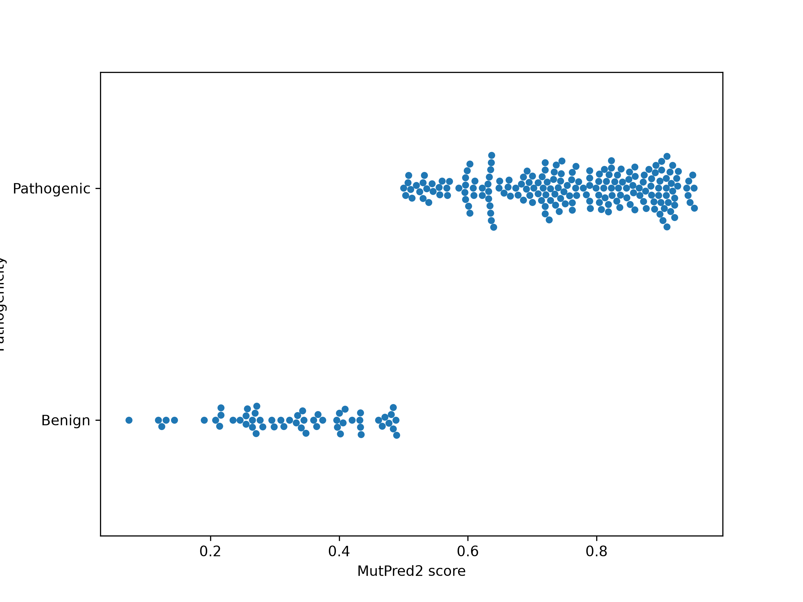
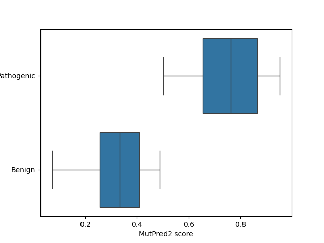
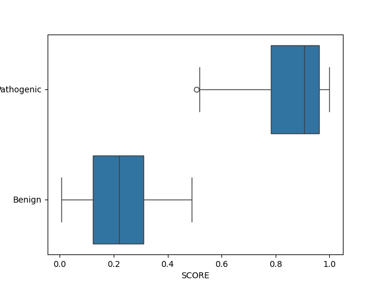
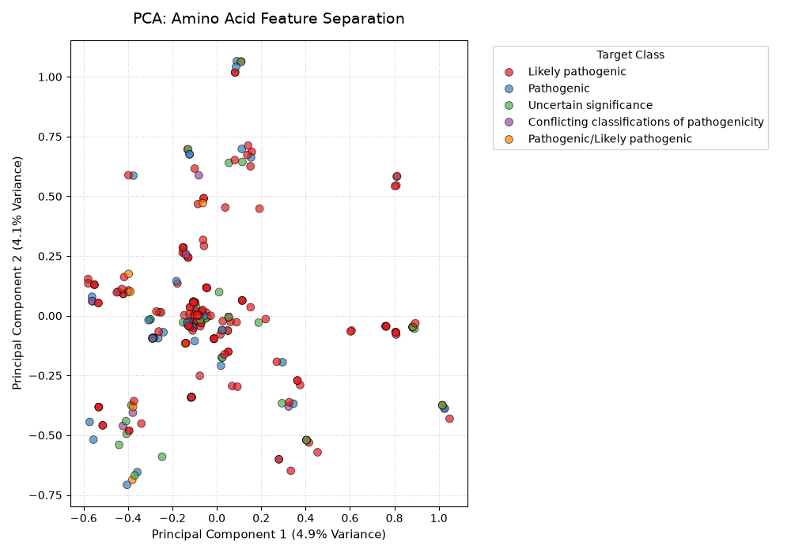
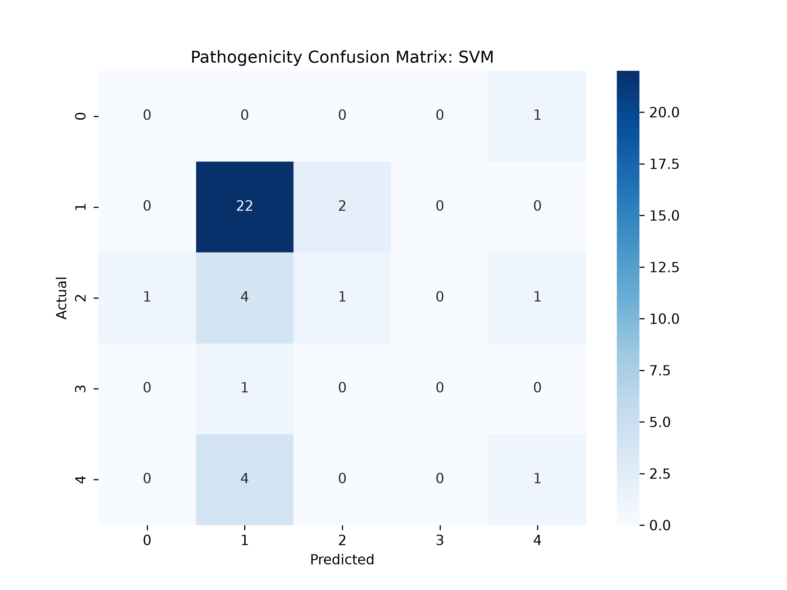
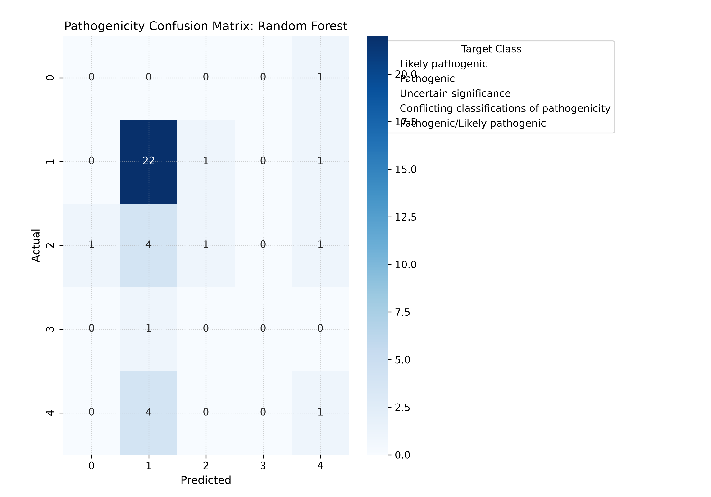

snakemake command; snakemake --cores 4 --forceall


# Background

Phenylketonuria (PKU) is an autosomal recessive inborn error of metabolism caused primarily by pathogenic variants in the phenylalanine hydroxylase (PAH) gene. PAH encodes a hepatic enzyme that catalyzes the conversion of phenylalanine (Phe) to tyrosine (Tyr). When PAH function is impaired, Phe accumulates in the blood and can cross the blood-brain barrier, resulting in neurological toxicity.

Untreated PKU can lead to intellectual disability, seizures, behavioral abnormalities, and other neurological complications. Early diagnosis and treatment are therefore critical.

PAH requires the cofactor tetrahydrobiopterin (BH4) for catalytic activity. Tyrosine produced by PAH is also a precursor to melanin, which helps explain the hypopigmentation sometimes observed in individuals with PKU.

This project investigates the pathogenicity of missense variants in PAH using experimentally curated ClinVar classifications and computational protein-level pathogenicity predictors. The goal is to characterize how different amino acid substitutions are predicted to affect PAH and to explore machine-learning approaches for variant classification.

# Motivation

PKU is one of the best-characterized inherited metabolic disorders and provides an important model for studying genotype–phenotype relationships and precision medicine.

Current treatments include:

Dietary Phe restriction to prevent toxic accumulation

Sapropterin dihydrochloride, a synthetic form of BH4 that can improve residual PAH activity in responsive patients

Sepiapterin, a precursor in the BH4 pathway

Pegvaliase, an enzyme replacement therapy that metabolizes phenylalanine independently of PAH

Emerging approaches include large neutral amino acid supplementation to reduce Phe transport into the brain, gene therapy approaches designed to restore functional PAH expression in hepatocytes, and mRNA therapies that deliver PAH mRNA to the liver.

Understanding which specific PAH variants are associated with pathogenicity can help improve variant interpretation and prioritization, providing insight into how individual amino acid substitutions may disrupt PAH function.

# Repository Structure

```
.
|-- Figures
|   |-- MutPred2_Score_Beeswarm.png
|   |-- MutPred2_Score_Pathogenicity_Boxplot.png
|   |-- MutPred2_Score_Stripplot.png
|   |-- Pathogenicity_Confusion_Matrix_Random_Forest.png
|   |-- Pathogenicity_Confusion_Matrix_SVM.png
|   |-- PhD_SNPg_Alternate_Nucleotide_Stripplot.png
|   |-- PhD_SNPg_PhyloP100_Beeswarm.png
|   |-- PhD_SNPg_Score_Beeswarm.png
|   |-- PhD_SNPg_Score_Pathogenicity_Boxplot.png
|   `-- SVM_PCA.png
|-- Peptides
|   `-- wildtype.fasta
|-- congif.yaml
|-- docs
|   |-- Mutpred2_Results.tsv
|   |-- Phd-Snp_Results.tsv
|   |-- Phd_SNPg_Results.txt
|   |-- cleaned.json
|   |-- clinvar_result.txt
|   |-- deletions.txt
|   |-- esearch.json
|   |-- esummary.json
|   |-- features.txt
|   |-- frameshift.txt
|   |-- label.txt
|   |-- mutpred2_results.txt
|   |-- nonsense.txt
|   |-- silent.txt
|   |-- substitutions.txt
|   |-- test.py
|   `-- variant_type
|-- scripts
|   |-- in_progress
|   |   `-- mutations.py
|   |-- RF.py
|   |-- SVM.py
|   |-- accuracy.py
|   |-- beeswarm.py
|   |-- boxplot.py
|   |-- cleaned.json
|   |-- esummary.py
|   |-- missense.py
|   |-- mutpred.sh
|   `-- variants_esearch.py
`-- PKU_README.md
```

# Project Workflow

Retrieve ClinVar records through the NCBI E-utilities API

Parse XML records using Biopython

Filter missense variants

Extract HGVS protein substitutions

Run pathogenicity prediction tools

Generate visualizations

Train machine learning classifiers (in progress)


# Dataset

PAH variants were obtained from ClinVar using NCBI E-utilities through command-line and Python-based workflows.

The initial search queried PAH variants associated with phenylketonuria and clinically significant pathogenic classifications:


"term": 'PAH[gene] AND Phenylketonuria[disease/phenotype] AND (pathogenic[Clinical significance] OR likely pathogenic[Clinical significance])'

1. Retrieve CiinVar record through the NCBI E-utilities API

The NCBI E-utilities used included:

- esearch: retrieve ClinVar record identifiers

- esummary: retrieve summary information for records

- efetch: retrieve complete ClinVar records

esearch initially returns ClinVar record UIDs. Complete variant information was subsequently retrieved using efetch.

Parse XML records using Biopython

ClinVar records were processed from XML, where variant information is represented using nested tags. esummary data were also processed using Biopython to extract structured information such as:

Variants, substitutions, mutation types, and pathogenicity.


2. Filter Missense Mutations

The dataset was filtered to focus on missense variants, which result in an amino acid substitution in the PAH protein.
Nonsense and frameshift variants were removed from the initial analysis.

The resulting dataset contained approximately 250 reported PAH missense substitutions 
associated with PKU.

4. Extracted Features

For each variant, the following information was extracted:

- Variant type
- Variation name
- HGVS protein notation
- Wild-type to mutant amino acid change
- Molecular consequence list
- Germline classification
- ClinVar clinical significance
- Oncology classification
- HGVS Protein Notation

HGVS (Human Genome Variation Society) nomenclature provides a standardized description of sequence variants at the DNA, RNA, and protein levels.

For example:

p.Leu213Phe indicates that the leucine residue at position 213 has been substituted with phenylalanine. 

One variant of interest identified during exploratory analysis was L213F, a leucine-to-phenylalanine substitution.

Leucine is also a large neutral amino acid that competes with phenylalanine for transport across the blood-brain barrier. This relationship is relevant to PKU because increasing the availability of large neutral amino acids can reduce the transport of Phe into the brain.

Run pathogenicity prediction tools

Two computational predictors were used to investigate the potential effects of PAH amino acid substitutions:

- MutPred2
- PhD-SNPg

These tools evaluate whether individual amino acid substitutions are likely to have deleterious effects.

A. MutPred2

MutPred2 is a machine-learning-based predictor of the pathogenicity of amino acid substitutions. It uses sequence-derived features describing the wild-type and mutant proteins and applies neural-network models to estimate the likelihood that a substitution is disease-associated.

Input: A PAH protein FASTA sequence containing the relevant amino acid substitutions.

MutPred2 reports:

g — general pathogenicity score

Pr — posterior probability associated with predicted molecular effects

The general score ranges from 0 to 1, with higher values indicating a greater predicted likelihood of pathogenicity.

For this analysis:

MutPred2 score > 0.5 → predicted pathogenic

B. PhD-SNPg

PhD-SNPg is a machine-learning predictor that uses a Gradient Boosting to classify single amino acid substitutions as pathogenic or benign.

The prediction incorporates information such as:

- Amino acid position
- Wild-type residue
- Mutant residue

**Outputs**

PhD-SNPg provides information including:

- Chromosome position
- Functional description
- Amino acid mutation
- Type of gene 
- Protein function
- Predicted pathogenicity
- Prediction confidence/accuracy metrics


6. Visualizations and Exploratory Analysis

The predictions from MutPred2 and PhD-SNPg were compared based on pathogenicity results. 








When the pathogenicity labels were extracted from the ClinVar results for missense variants, there were no benign labels. The stripplots and beeswarm plots of both MutPred2 and PhD-SNPg show that the majority of the substitutions are pathogenic in PAH. However, there are still benign predictions. This is contrary to the original dataset predictions, and zooms in on specific substitutions to be more probable pathogenic candidates. Moreover, the interquartile range of MutPred2 predictions are narrower in the Benign class than the Pathogenic class, while that of the PhD_SNPg predictions do not look too different.

**Results**

The ClinVar-derived dataset contained pathogenic and uncertain/conflicting classifications but did not contain benign missense variants in the subset used for the initial analysis.

Interestingly, the computational predictors produced a mixture of pathogenic and benign/neutral predictions.

Both MutPred2 and PhD-SNPg predicted that the majority of analyzed PAH substitutions were likely pathogenic, while still identifying a subset of substitutions with lower predicted pathogenicity.

This distinction is useful because the computational predictions provide additional information beyond the original ClinVar classifications and allow individual substitutions to be examined more closely.

**MutPred2**

The MutPred2 score distributions showed differences between substitutions predicted to be pathogenic and those predicted to be benign/neutral. The interquartile range was narrower for the lower-pathogenicity group than for the higher-pathogenicity group. 

**PhD-SNPg**

PhD-SNPg similarly produced a mixture of pathogenic and benign/neutral predictions, although the distributions between the predicted classes appeared less separated than those observed for MutPred2.

These results demonstrate that computational predictors can provide additional resolution when examining individual amino acid substitutions within a disease-associated gene.

7. Train Machine Learning Classifiers

To explore an independent machine-learning approach, supervised models were trained using variant-level features.

The initial models included:

- Support Vector Machine (SVM)
- Random Forest
- They relied on substitutions from wild-type amino acid, mutant amino acid, and amino acid position information.
- Next steps will consider Isoelectric point (pI) and hydrophobicity. 

Since amino acid substitutions can alter protein charges and physicochemical properties, pI-related features may provide useful information for distinguishing variants with different functional effects.


**Exploratory Analysis: PCA Visualization**



**SVM Results**

The best initial SVM configuration achieved:

C = 100, gamma = 1, validation accuracy = 0.656, training accuracy = 0.978

Final Test Accuracy (svm_rbf): 0.632



The high training accuracy compared to validation and test accuracy suggests overfitting. gamma = 1 is a higher value, which creates tight boundaries around individual points. Another method to choose gamma must be explored in addition to checking feature dimensionality due to one-hot encoding and cross-validation for hyperparameters.

The overfitting and low test accuracy limits reliability on the model for pathogenicity prediction and feature importance.

A Radial Basis Function (RBF) is suited for this kind of problem because amino acid substitution effects on pathogenicity are unlikely to be linearly separable, as it is a biologically non-linear problem.


**Random Forest Results**

Best number of estimators by validation: 10

Final Test Accuracy Random Forest: 0.632




The Random Forest model slightly outperformed the initial SVM model based on accuracy.

However, these results should be interpreted cautiously because the dataset is relatively small. Additional validation and feature engineering are needed before assessing the generalizability of these models.


**Discussion**
This project combines clinical variant data, protein-level pathogenicity prediction, and machine learning to investigate missense variation in PAH associated with PKU.

An important observation was that the ClinVar-derived dataset and computational predictors did not produce identical classifications. Although the original dataset consisted of clinically reported pathogenic, likely pathogenic, conflicting, and uncertain variants, MutPred2 and PhD-SNPg identified a broader range of predicted effects.

This discrepancy provides an opportunity to investigate individual PAH substitutions in greater detail rather than treating all clinically associated variants as equivalent.

The initial machine-
learning models achieved approximately 63–66% accuracy, suggesting that variant-level biochemical and sequence features may contain predictive information. However, these preliminary results are not sufficient to establish a clinically useful classifier.

Additionally, negative feature importance in SVM and near-zero feature importance in Random Forest support the likelihood of overfitting, which makes pathogenicity predictions unreliable. This is a priority next step before deciding what variants and properties are most likely to contribute to the PKU and induce neurological harm in newborns.

8. Next Steps

Future work will focus on improving the machine-learning pipeline and expanding the biological interpretation of individual variants. 

Incorporate additional features such as:

- Amino acid physicochemical properties
- Isoelectric point
- Charge

Model validation: 

- Cross-validation
- Independent test sets
- Precision, recall, and F1-score
- ROC-AUC
- Precision-recall AUC
- Class balancing techniques

These metrics will provide a more complete assessment than accuracy alone.


**Structural Analysis**

The effects of high-priority substitutions will be investigated using protein structural modeling tools such as AlphaFold. It would be helpful to see if variants are related to specific PAH structure such as the catalytic domain, conserved residues, or the BH4-binding region.

Additionally, running the machine learning pipelines on additional mutations such as frameshifts and nonsense mutations can give a more holistic view of the mutations that drive PKU. Each component of the pipeline will be automated using SnakeMake.

# Technologies and Tools**

**Programming**

- Python

- R

- Bash / Unix

**Bioinformatics**

- NCBI ClinVar

- NCBI E-utilities

- Biopython

- MutPred2

- PhD-SNPg

**Machine Learning**

- Support Vector Machines

- Random Forest

- Principal Component Analysis (PCA)

**Data Analysis & Visualization**

- pandas

- NumPy

- scikit-learn

- Matplotlib

- Seaborn

**Author**

Aarthi Bharathan B.S. Computational & Applied Mathematics and Statistics in Mathematical Biology, College of William & Mary 
